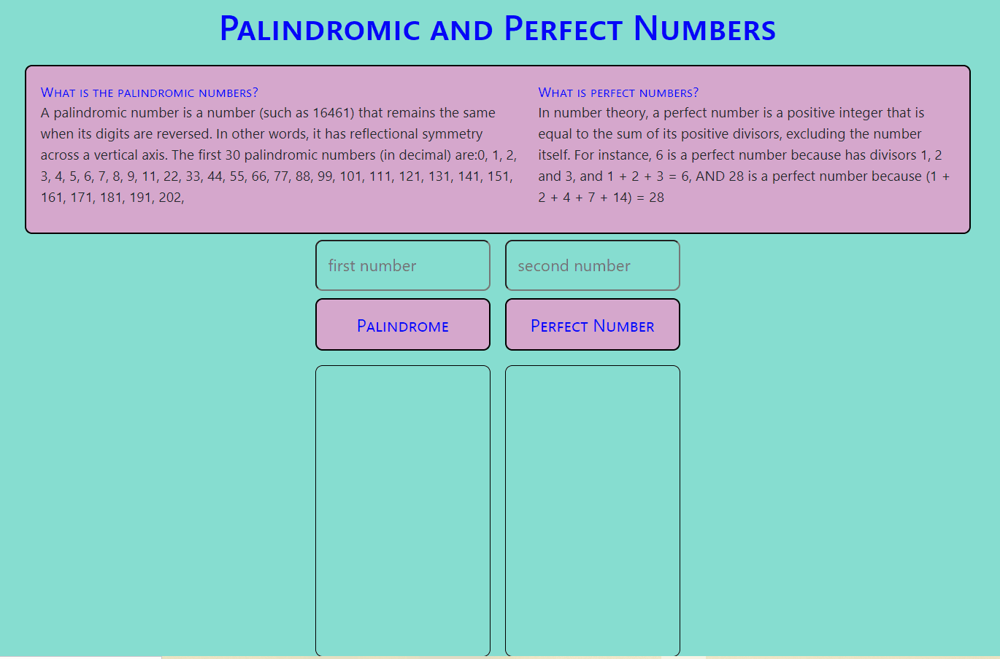

# Project : Template

## Check The Live Website ➡️ [Live Website](https://palindromandperfectnumber.netlify.app/)

## Visualization of the Website



## Description

Purpose of the this coding challenge is to write a code that can list all the numbers in the given range, whether they are palindromic or perfect numbers.

## Learning Outcomes

At the end of the this coding challenge, students will be able to;

- analyze a problem, identify and apply programming knowledge for appropriate solution.

- demonstrate their knowledge of algorithmic design principles by using JavaScript effectively.

## Problem Statement

- Take one or two inputs from user. List the results in the relevant fields using two different buttons.
- Examples:
    - if top low limit is 0 and limit value is 1000. List all palindromic and perfect numbers between 0 and 1000.
    - if top low limit is 50 and limit value is 100. List all palindromic and perfect numbers between 50 and 100.


## Project Skeleton

```
Project(folder)
|
|----README.md
├── public
│     └── index.html
├── src
│    ├── components
│    │       ├── Main.jsx
│    │       ├── Main.scss
│    │       
│    ├── App.js
│    ├── index.js
└── package.json
```

### Overview

I mastered HTML & CSS & JS & ReactJS & ReactSass features in this project.
You can see the visual representation of the website above.


# <center> ⌛ Happy Coding ✍ </center>
